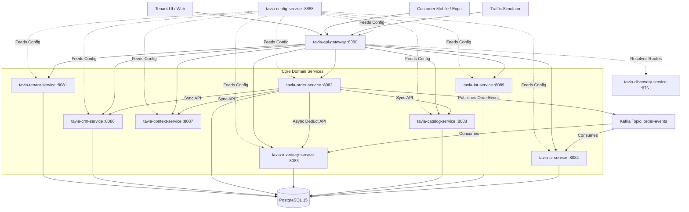

# TAVIA V2 - Global Loyalty Ecosystem and Autonomous Smart Cafe Platform

## Project Overview
TAVIA V2 is an advanced Global Loyalty Ecosystem and Autonomous Smart Cafe Platform built for the year 2026. The architecture is designed to support high-scale operations, multi-tenancy, and autonomous features. The platform is strategically founded on three primary pillars:

1. **Tenant Profit Optimization AI**: Analyzes real-world temporal data (weather, events, holidays, competitor occupancy) to optimize dynamic pricing, provide context-aware discounts, and forecast raw material inventory dynamically.
2. **Customer Experience AI**: Manages mobile app interactions (built with React Native/Expo), delivering context-aware discovery, personalized coupons, and localized loyalty rewards.
3. **IoT Autonomous Execution**: Autonomous smart machines prepare orders and brew coffee while emitting telemetry and consumption events. The architecture is fundamentally event-driven to support real-time physical reality synchronization.

## High-Level Architecture Flow



## Technology Stack

### Backend Stack
| Layer | Technology | Version |
|-------|-----------|---------|
| **Framework** | Spring Boot | 4.0.6 |
| **Language** | Java | 21 |
| **Cloud** | Spring Cloud | 2025.1.1 |
| **Database** | PostgreSQL | 15 |
| **Event Bus** | Kafka | Confluent 7.4.0 |
| **Mapping** | MapStruct | 1.5.5.Final |
| **API Gateway** | Spring Cloud Gateway | 2025.1.1 (WebFlux) |

### Frontend Stack (Tenant Dashboard)
| Layer | Technology | Version |
|-------|-----------|---------|
| **Framework** | Next.js (App Router) | 16.2.4 |
| **UI Library** | React | 19.2.4 |
| **Styling** | Tailwind CSS | v4 |
| **Components** | Shadcn UI | 4.x |
| **State Management**| Zustand + React Query | 5.x |

### Mobile Stack (Customer UI)
| Layer | Technology | Version |
|-------|-----------|---------|
| **Framework** | Expo | ~54.0.33 |
| **UI Library** | React Native | 0.81.5 |
| **Routing** | Expo Router | ~6.0.23 |
| **State Management**| Zustand | 5.x |
| **Data Fetching** | Axios | 1.15.x |

## Setup Instructions

TAVIA V2 is heavily microservice-oriented and utilizes standard containerization and scripting for ease of use.

### 1. Prerequisites
- Docker & Docker Compose
- Java 21 Toolchain
- Node.js 20+

### 2. Bootstrapping Infrastructure
Start the core infrastructure (PostgreSQL, Kafka, Zookeeper, pgAdmin) using Docker Compose:
```bash
docker-compose up -d
```

### 3. Starting the Services
You can start all Spring Boot backend services using the provided bash script. The script ensures the correct boot order (Config -> Eureka -> Core Services -> Gateway -> Simulator).
```bash
./tavia.sh start
```

### 4. Running the Frontend
**Tenant UI:**
```bash
cd tavia-ui
npm install
npm run dev
```

**Customer Mobile UI:**
```bash
cd tavia-customer-ui
npm install
npx expo start
```
