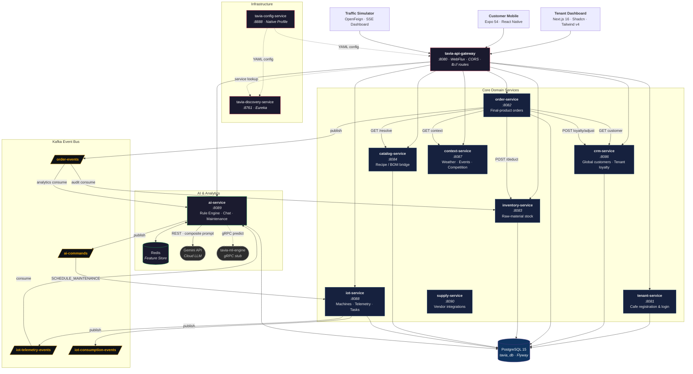

<div align="center">

# TAVIA V2

### Global Loyalty Ecosystem & Autonomous Smart Cafe Platform

A multi-tenant SaaS platform combining **AI-powered profit optimization**, **Gemini-driven customer experience**, and **IoT autonomous machine execution** into a single, event-driven microservice ecosystem.


</div>

---

## Product Vision — Hybrid Multi-Agent Architecture

TAVIA V2 operates under strict hardware constraints (16 GB RAM, 4 GB VRAM) which **forbid local LLMs**. Instead, a hybrid multi-agent strategy delivers world-class autonomy:

| Pillar | Agent | Technology | Purpose |
|--------|-------|------------|---------|
| **Tenant Profit Optimization** | Tabular ML Agent | Scikit-Learn / XGBoost via `tavia-ml-engine` (Python/FastAPI, ~200 MB RAM) + gRPC bridge | Dynamic pricing, demand forecasting, predictive maintenance scoring |
| **Customer Experience** | NLP / Chatbot Agent | Gemini API (Cloud LLM) via `GeminiApiClient` | Context-aware discovery, personalized coupons, loyalty rewards, customer support chat |
| **IoT Autonomous Execution** | Autonomous Command Center | Kafka event-driven + Redis Feature Store + `PredictiveMaintenanceScheduler` | Machine telemetry, order execution, `SCHEDULE_MAINTENANCE` commands when failure probability > 90% |

---

## Architecture Diagram



---

## Core Modules & Tech Stack

### Backend Backbone
| Layer | Technology | Version |
|-------|------------|---------|
| **JVM** | Java (Temurin Toolchain) | **21** |
| **Framework** | Spring Boot | **4.0.6** |
| **Cloud** | Spring Cloud | **2025.1.1** |
| **Gateway** | Spring Cloud Gateway (WebFlux) | 2025.1.1 |
| **Persistence** | Spring Data JPA + Hibernate | Boot 4.x aligned |
| **Migrations** | Flyway Core + PostgreSQL | **12.5.0** |
| **Validation** | Jakarta Validation | 4.0.6 |
| **Mapping** | MapStruct | **1.5.5.Final** |
| **Messaging** | Spring Kafka | 4.0.6 |
| **Cache** | Spring Data Redis | 4.0.6 |
| **Feign** | Spring Cloud OpenFeign | 2025.1.1 |
| **OpenAPI** | springdoc-openapi (WebMVC) | **3.0.3** |
| **Build** | Gradle (Groovy DSL) + Wrapper | — |

### Infrastructure (Docker Compose)
| Component | Image | Port | Memory Limit |
|-----------|-------|------|--------------|
| **PostgreSQL** | `postgres:15-alpine` | 5432 | 256 MB |
| **Kafka** | `confluentinc/cp-kafka:7.4.0` | 9092 | 512 MB |
| **Zookeeper** | `confluentinc/cp-zookeeper:7.4.0` | 2181 | 128 MB |
| **Redis** | `redis:7-alpine` | 6379 | 64 MB |
| **pgAdmin** | `dpage/pgadmin4` | 5050 | — |

### Tenant Operational Dashboard (`tavia-ui`)
| Layer | Technology | Version |
|-------|------------|---------|
| **Framework** | Next.js (App Router) | **16.2.4** |
| **React** | React + React DOM | **19.2.4** |
| **Styling** | Tailwind CSS (oklch) | **v4** |
| **UI Kit** | Shadcn UI | **4.5.0** |
| **State** | Zustand (persisted) + React Query | 5.0.12 / 5.100.5 |
| **Forms** | React Hook Form + Zod | — |
| **Toasts** | sonner | 2.0.7 |
| **Icons** | lucide-react | 1.11.0 |

### Customer Mobile App (`tavia-customer-ui`)
| Layer | Technology | Version |
|-------|------------|---------|
| **Runtime** | Expo (New Architecture) | **~54.0.33** |
| **Router** | expo-router (typed routes) | **~6.0.23** |
| **React** | React Native | **0.81.5** |
| **HTTP** | Axios | **1.15.2** |
| **State** | Zustand + AsyncStorage | 5.0.12 |
| **Forms** | React Hook Form + Zod | 7.74.0 / 4.4.1 |
| **Animations** | react-native-reanimated | ~4.1.1 |

---

## Service Directory & Ports

| Service | Port | Description |
|---------|------|-------------|
| `tavia-config-service` | **8888** | Spring Cloud Config Server (Native profile, serves `/configurations/`) |
| `tavia-discovery-service` | **8761** | Eureka Server — central service registry |
| `tavia-api-gateway` | **8080** | WebFlux reactive gateway — single public entry point |
| `tavia-tenant-service` | **8081** | Cafe operator registration, login, status management |
| `tavia-order-service` | **8082** | Final-product order processing, enrichment, Kafka publishing |
| `tavia-inventory-service` | **8083** | Raw-material stock tracking (DDD: never tracks final products) |
| `tavia-catalog-service` | **8084** | Recipe / BOM bridge — resolves products into raw ingredients |
| `tavia-crm-service` | **8086** | Global customer identity, tenant-scoped loyalty, auth |
| `tavia-context-service` | **8087** | Environmental context provider (weather, events, competition) |
| `tavia-iot-service` | **8088** | Machine registry, telemetry ingestion, task management |
| `tavia-ai-service` | **8089** | AI analytics, Gemini chat, rule engine, predictive maintenance |
| `tavia-supply-service` | **8090** | External vendor integrations (skeleton) |
| `tavia-traffic-simulator` | **8095** | Closed-loop load generator with SSE dashboard |

---

## Kafka Topic Map

| Topic | Producer | Consumer(s) | Purpose |
|-------|----------|-------------|---------|
| `order-events` | `tavia-order-service` | `tavia-inventory-service`, `tavia-ai-service` | Enriched order event with `deductions[]` |
| `ai-commands` | `tavia-ai-service` | `tavia-iot-service` | Predictive maintenance commands (`SCHEDULE_MAINTENANCE`) |
| `iot-telemetry-events` | `tavia-iot-service` | `tavia-ai-service` | Machine telemetry → Redis Feature Store |
| `iot-consumption-events` | `tavia-iot-service` | — | Raw material consumption from machines |
| `context-events` | — | — | Reserved for environmental context updates |

---

## Getting Started

### Prerequisites
- **Docker & Docker Compose** — for PostgreSQL, Kafka, Zookeeper, Redis, pgAdmin
- **Java 21** (Temurin) — JVM toolchain for all backend services
- **Node.js 20+** — for Next.js and Expo frontends
- **Expo CLI** — for mobile development (`npx expo`)

### Step 1 — Infrastructure

Start the containerized infrastructure:

```bash
docker-compose up -d
```

### Step 2 — Export JVM Memory Constraints

All backend services **must** run with constrained JVM memory to prevent OOM on a 16 GB host running 12+ services:

```bash
export JAVA_TOOL_OPTIONS="-Xms64m -Xmx128m -XX:MaxMetaspaceSize=128m -XX:+UseSerialGC -XX:+TieredCompilation -XX:TieredStopAtLevel=1"
```

### Step 3 — Boot the Backend (Strict Order)

Services must boot in the correct dependency order. Use the provided orchestration script:

```bash
./tavia.sh start
```

The boot sequence follows these phases:

| Phase | Services | Rationale |
|-------|----------|-----------|
| **Phase 0 — Infrastructure** | `tavia-config-service` → `tavia-discovery-service` | Config must be available before any service boots; Eureka registers all others |
| **Phase 1 — Core Data** | `tavia-tenant-service` → `tavia-inventory-service` → `tavia-catalog-service` | Foundational data stores needed by operational services |
| **Phase 2 — Operations** | `tavia-crm-service` → `tavia-order-service` → `tavia-iot-service` → `tavia-supply-service` | Business logic services that depend on Phase 1 |
| **Phase 3 — Analytics** | `tavia-context-service` → `tavia-ai-service` | AI and context enrichment rely on operational services |
| **Phase 4 — Gateway** | `tavia-api-gateway` | Routes are resolved via Eureka; all backends must be registered first |
| **Phase 5 — Simulation** | `tavia-traffic-simulator` | Load generator assumes the full ecosystem is online |

### Step 4 — Tenant Dashboard (Web)

```bash
cd tavia-ui
npm install
npm run dev
```

The Next.js dev server rewrites `/api/:path*` → `http://localhost:8080/api/v1/:path*` through the gateway.

### Step 5 — Customer Mobile App

```bash
cd tavia-customer-ui
npm install
npx expo start
```

> **Note:** Axios base URL is resolved dynamically from `EXPO_PUBLIC_API_URL` → device script URL → `debuggerHost` → `localhost:8080`. Never hardcode IPs.

---

## Key Domain Invariants

- **Global Customer / Local Loyalty** — The `customers` table has **no `tenant_id`**. Loyalty is scoped per-tenant via `tenant_loyalty(customer_id, tenant_id)`.
- **Recipe-Based Production** — `inventory-service` tracks only raw materials. `order-service` processes final products. `catalog-service` is the BOM bridge between them.
- **12-City Enum** — Only `ISTANBUL, ANKARA, IZMIR, BURSA, ANTALYA, ADANA, KONYA, SANLIURFA, GAZIANTEP, KOCAELI, ESKISEHIR, ISPARTA`. Enforced as Java enums and TypeScript enums/unions globally.
- **X-Tenant-ID Header** — Every tenant-scoped request carries `X-Tenant-ID` as a UUID header. Never a query parameter.
- **RFC 7807 ProblemDetail** — All error responses use `ProblemDetail` with `traceId`, `timestamp`, and typed `https://tavia.com/errors/*` URIs.

---

<div align="center">
<sub>Built with precision for the 2026 autonomous cafe era.</sub>
</div>
